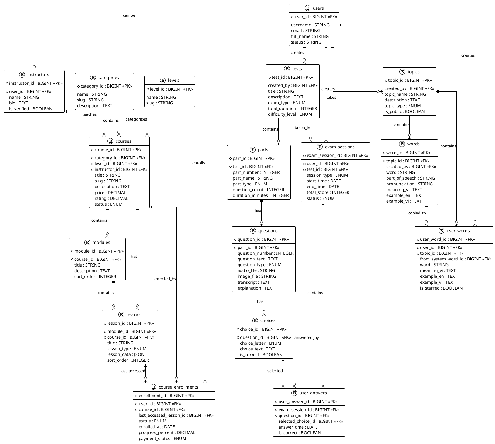
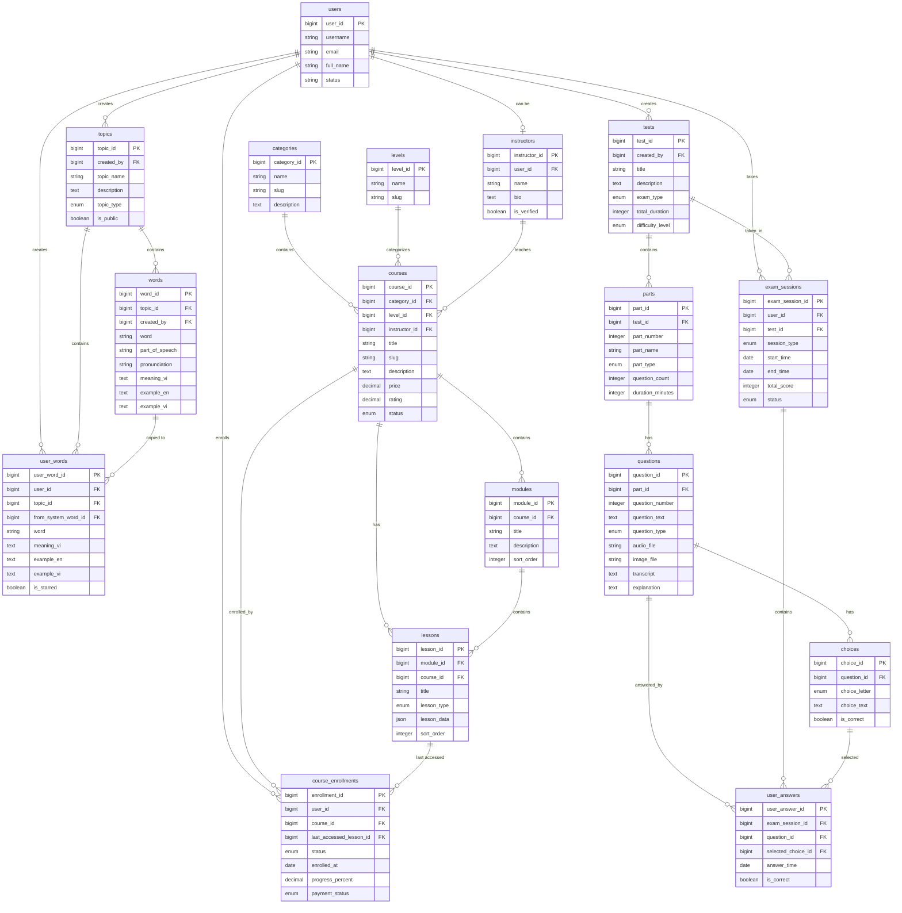

# 📊 ERD MỨC KHÁI NIỆM (CONCEPTUAL ERD) - HỆ THỐNG E-LEARNING

## 🎯 MỤC ĐÍCH

ERD này thể hiện **chỉ các entity chính và mối quan hệ** ở mức khái niệm, bao gồm:

- ✅ Primary Keys (PK) - Định danh entity
- ✅ Foreign Keys (FK) - Thể hiện quan hệ
- ✅ Các thuộc tính nghiệp vụ quan trọng nhất
- ❌ Không bao gồm: bảng trung gian, bảng thống kê, bảng phụ trợ

---

## 📋 CÁC ENTITY CHÍNH (CORE ENTITIES)

### 1. 🔐 AUTHENTICATION & AUTHORIZATION

#### **users**

- **PK**: `user_id`
- **Thuộc tính**: `username`, `email`, `full_name`, `status`
- **Quan hệ**:
  - 1:N → `course_enrollments`, `exam_sessions`, `user_words`
  - 1:1 → `instructors` (optional)

#### **instructors**

- **PK**: `instructor_id`
- **FK**: `user_id` → `users.user_id` (nullable)
- **Thuộc tính**: `name`, `bio`, `is_verified`
- **Quan hệ**: 1:N → `courses`

---

### 2. 📚 COURSE SYSTEM

#### **categories**

- **PK**: `category_id`
- **Thuộc tính**: `name`, `slug`, `description`
- **Quan hệ**: 1:N → `courses`

#### **levels**

- **PK**: `level_id`
- **Thuộc tính**: `name`, `slug`
- **Quan hệ**: 1:N → `courses`

#### **courses**

- **PK**: `course_id`
- **FK**: `category_id` → `categories.category_id`
- **FK**: `level_id` → `levels.level_id`
- **FK**: `instructor_id` → `instructors.instructor_id`
- **Thuộc tính**: `title`, `slug`, `description`, `price`, `rating`, `status`
- **Quan hệ**:
  - 1:N → `modules`, `lessons`, `course_enrollments`

#### **modules**

- **PK**: `module_id`
- **FK**: `course_id` → `courses.course_id`
- **Thuộc tính**: `title`, `description`, `sort_order`
- **Quan hệ**: 1:N → `lessons`

#### **lessons**

- **PK**: `lesson_id`
- **FK**: `module_id` → `modules.module_id`
- **FK**: `course_id` → `courses.course_id`
- **Thuộc tính**: `title`, `lesson_type`, `lesson_data` (JSON), `sort_order`
- **Quan hệ**: 1:N → `course_enrollments` (last_accessed_lesson_id)

#### **course_enrollments**

- **PK**: `enrollment_id`
- **FK**: `user_id` → `users.user_id`
- **FK**: `course_id` → `courses.course_id`
- **FK**: `last_accessed_lesson_id` → `lessons.lesson_id` (nullable)
- **Thuộc tính**: `status`, `enrolled_at`, `progress_percent`, `payment_status`

---

### 3. 📝 EXAM SYSTEM

#### **tests**

- **PK**: `test_id`
- **FK**: `created_by` → `users.user_id` (nullable)
- **Thuộc tính**: `title`, `description`, `exam_type`, `total_duration`, `difficulty_level`
- **Quan hệ**: 1:N → `parts`, `exam_sessions`

#### **parts**

- **PK**: `part_id`
- **FK**: `test_id` → `tests.test_id`
- **Thuộc tính**: `part_number`, `part_name`, `part_type`, `question_count`, `duration_minutes`
- **Quan hệ**: 1:N → `questions`

#### **questions**

- **PK**: `question_id`
- **FK**: `part_id` → `parts.part_id`
- **Thuộc tính**: `question_number`, `question_text`, `question_type`, `audio_file`, `image_file`, `transcript`, `explanation`
- **Quan hệ**: 1:N → `choices`, `user_answers`

#### **choices**

- **PK**: `choice_id`
- **FK**: `question_id` → `questions.question_id`
- **Thuộc tính**: `choice_letter`, `choice_text`, `is_correct`

#### **exam_sessions**

- **PK**: `exam_session_id`
- **FK**: `user_id` → `users.user_id`
- **FK**: `test_id` → `tests.test_id`
- **Thuộc tính**: `session_type`, `start_time`, `end_time`, `total_score`, `status`
- **Quan hệ**: 1:N → `user_answers`

#### **user_answers**

- **PK**: `user_answer_id`
- **FK**: `exam_session_id` → `exam_sessions.exam_session_id`
- **FK**: `question_id` → `questions.question_id`
- **FK**: `selected_choice_id` → `choices.choice_id` (nullable)
- **Thuộc tính**: `answer_time`, `is_correct`

---

### 4. 🎴 VOCABULARY SYSTEM

#### **topics**

- **PK**: `topic_id`
- **FK**: `created_by` → `users.user_id` (nullable)
- **Thuộc tính**: `topic_name`, `description`, `topic_type`, `is_public`
- **Quan hệ**: 1:N → `words`, `user_words`

#### **words**

- **PK**: `word_id`
- **FK**: `topic_id` → `topics.topic_id`
- **FK**: `created_by` → `users.user_id` (nullable)
- **Thuộc tính**: `word`, `part_of_speech`, `pronunciation`, `meaning_vi`, `example_en`, `example_vi`
- **Quan hệ**: 1:N → `user_words` (from_system_word_id)

#### **user_words**

- **PK**: `user_word_id`
- **FK**: `user_id` → `users.user_id`
- **FK**: `topic_id` → `topics.topic_id`
- **FK**: `from_system_word_id` → `words.word_id` (nullable)
- **Thuộc tính**: `word`, `meaning_vi`, `example_en`, `example_vi`, `is_starred`

---

## 🔗 CODE PLANTUML

**Link PlantUML Online:** [https://www.plantuml.com/plantuml/uml/](https://www.plantuml.com/plantuml/uml/)

---

## 🔗 CODE MERMAID

---

## 📊 TÓM TẮT QUAN HỆ

### Quan hệ 1:1

- `users` ↔ `instructors` (optional)

### Quan hệ 1:N

- `users` → `course_enrollments`, `exam_sessions`, `user_words`, `topics`, `tests`
- `categories` → `courses`
- `levels` → `courses`
- `instructors` → `courses`
- `courses` → `modules`, `lessons`, `course_enrollments`
- `modules` → `lessons`
- `lessons` → `course_enrollments` (last_accessed_lesson_id)
- `tests` → `parts`, `exam_sessions`
- `parts` → `questions`
- `questions` → `choices`, `user_answers`
- `exam_sessions` → `user_answers`
- `topics` → `words`, `user_words`
- `words` → `user_words` (from_system_word_id)

---

## 📝 GHI CHÚ

1. **ERD này chỉ bao gồm các entity chính** - loại bỏ bảng trung gian, bảng thống kê, bảng phụ trợ
2. **Chỉ hiển thị thuộc tính nghiệp vụ quan trọng** - không bao gồm `created_at`, `updated_at`, `metadata`
3. **JSON fields** (như `lesson_data`) được thể hiện như thuộc tính JSON
4. **Optional relationships** được đánh dấu bằng `o` trong cardinality (0..1 hoặc 0..N)
5. **Tổng số entity chính: 17 entity**

---

## 🚀 CÁCH SỬ DỤNG

### PlantUML:

1. Copy code PlantUML ở trên
2. Paste vào [PlantUML Online Editor](https://www.plantuml.com/plantuml/uml/)
3. Hoặc sử dụng extension PlantUML trong VS Code

### Mermaid:

1. Copy code Mermaid ở trên
2. Paste vào [Mermaid Live Editor](https://mermaid.live/)
3. Hoặc sử dụng trong Markdown (GitHub, GitLab hỗ trợ tự động render)

---

**Tài liệu được tạo:** 2024  
**Mục đích:** ERD mức khái niệm - chỉ các entity chính  
**Tổng số entity:** 17 entity chính
