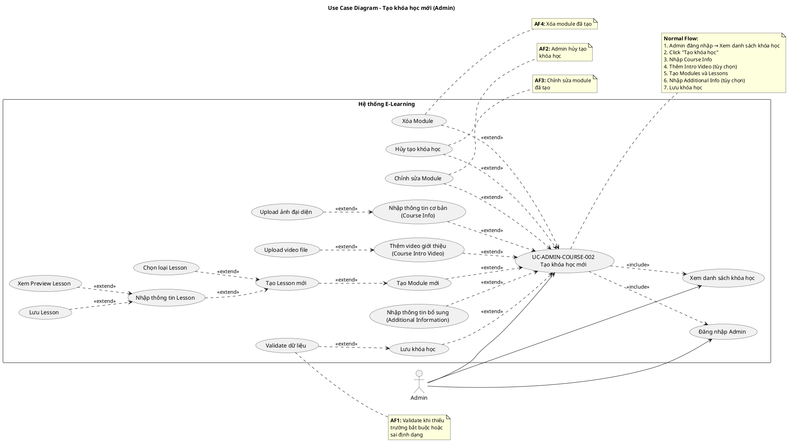
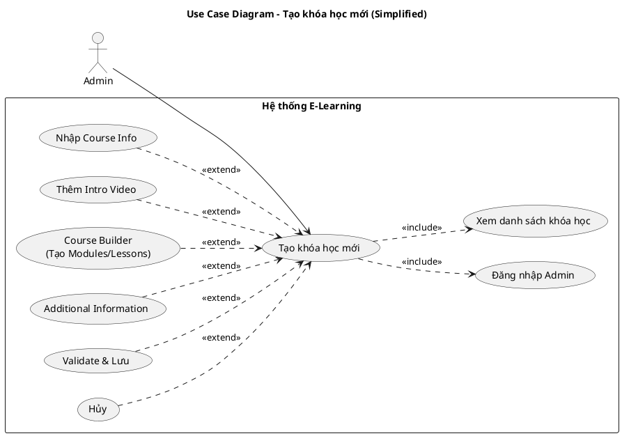
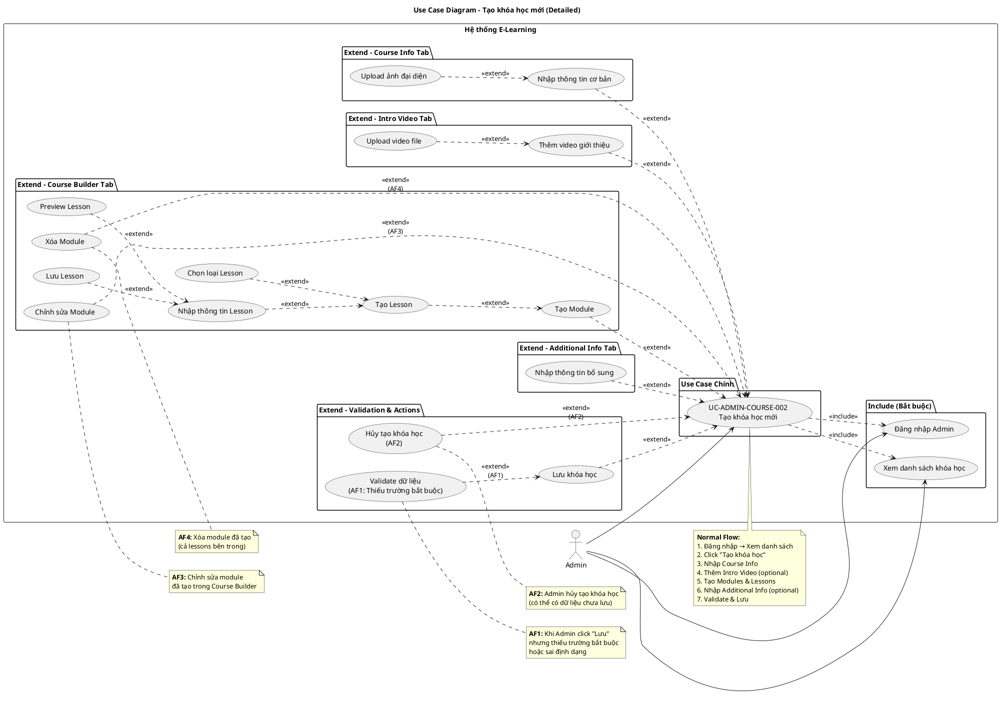

# 📊 USE CASE DIAGRAM - UC-ADMIN-COURSE-002: Tạo khóa học mới

## 🎯 Use Case Information

**Use Case ID:** UC-ADMIN-COURSE-002  
**Use Case Name:** Tạo khóa học mới  
**Primary Actor:** Admin  
**Secondary Actors:** Không có

---

## 🔷 PlantUML Code

---

## 🔷 Simplified PlantUML Code (Phiên bản đơn giản hơn)

---

## 🔷 Detailed PlantUML Code (Chi tiết đầy đủ với tất cả Alternative Flows)

---

## 📋 Giải thích các mối quan hệ

### 1. **<<include>> Relationships (Bắt buộc)**

- **Đăng nhập Admin**: Admin phải đăng nhập trước khi có thể tạo khóa học
- **Xem danh sách khóa học**: Admin phải truy cập màn danh sách khóa học trước khi click nút "Tạo khóa học"

### 2. **<<extend>> Relationships (Tùy chọn)**

#### **Course Info Tab:**

- **Nhập thông tin cơ bản**: Admin có thể nhập thông tin cơ bản (tiêu đề, mô tả, giá, danh mục, trình độ)
- **Upload ảnh đại diện**: Admin có thể upload ảnh (tùy chọn)

#### **Course Intro Video Tab:**

- **Thêm video giới thiệu**: Admin có thể thêm video giới thiệu (tùy chọn)
- **Upload video file**: Admin có thể upload video file (tùy chọn)

#### **Course Builder Tab:**

- **Tạo Module**: Admin có thể tạo module mới
- **Chỉnh sửa Module (AF3)**: Admin có thể chỉnh sửa module đã tạo
- **Xóa Module (AF4)**: Admin có thể xóa module đã tạo
- **Tạo Lesson**: Admin có thể tạo lesson trong module
- **Chọn loại Lesson**: Admin phải chọn loại lesson (Video, Vocabulary List, Quiz, v.v.)
- **Nhập thông tin Lesson**: Admin nhập thông tin lesson
- **Preview Lesson**: Admin có thể xem preview lesson trước khi lưu (tùy chọn)
- **Lưu Lesson**: Admin lưu lesson vào module

#### **Additional Information Tab:**

- **Nhập thông tin bổ sung**: Admin có thể nhập thông tin bổ sung (mục tiêu, kỹ năng, yêu cầu, v.v.) - tùy chọn

#### **Validation & Actions:**

- **Validate dữ liệu (AF1)**: Hệ thống validate khi Admin click "Lưu" nhưng thiếu trường bắt buộc
- **Lưu khóa học**: Admin lưu toàn bộ khóa học sau khi hoàn tất
- **Hủy tạo khóa học (AF2)**: Admin có thể hủy việc tạo khóa học

---

## 🔗 Cách sử dụng

1. Copy mã PlantUML vào [PlantUML Online Editor](https://www.plantuml.com/plantuml/uml/)
2. Hoặc sử dụng extension PlantUML trong VS Code
3. Diagram sẽ được render tự động

---

## 📝 Notes

- **<<include>>**: Mối quan hệ bắt buộc - Use case chính không thể hoàn thành nếu không thực hiện use case được include
- **<<extend>>**: Mối quan hệ tùy chọn - Use case mở rộng chỉ được thực hiện khi điều kiện cụ thể được thỏa mãn
- Các Alternative Flows (AF1-AF4) được đánh dấu rõ ràng trong diagram
