# SEQUENCE DIAGRAM - ADMIN QUẢN LÝ BÀI THI

## SEQUENCE 1: XEM DANH SÁCH ĐỀ THI

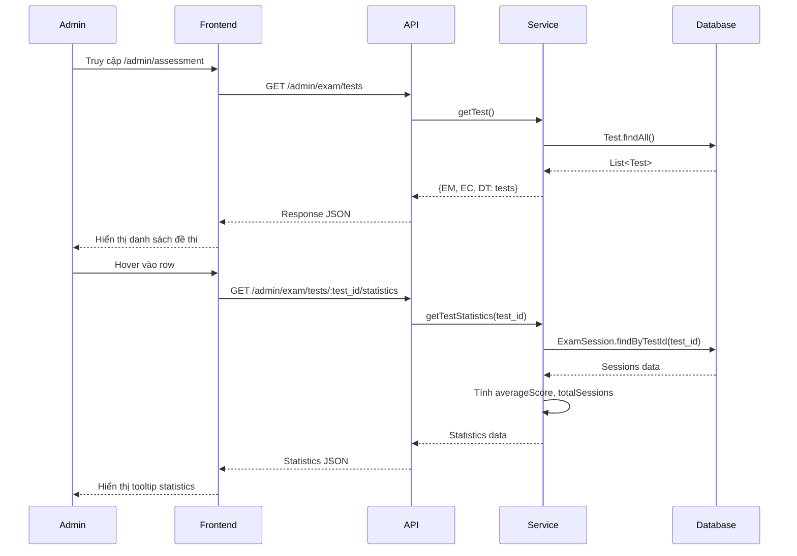

---

## SEQUENCE 2: TẠO ĐỀ THI MỚI (PIPELINE)

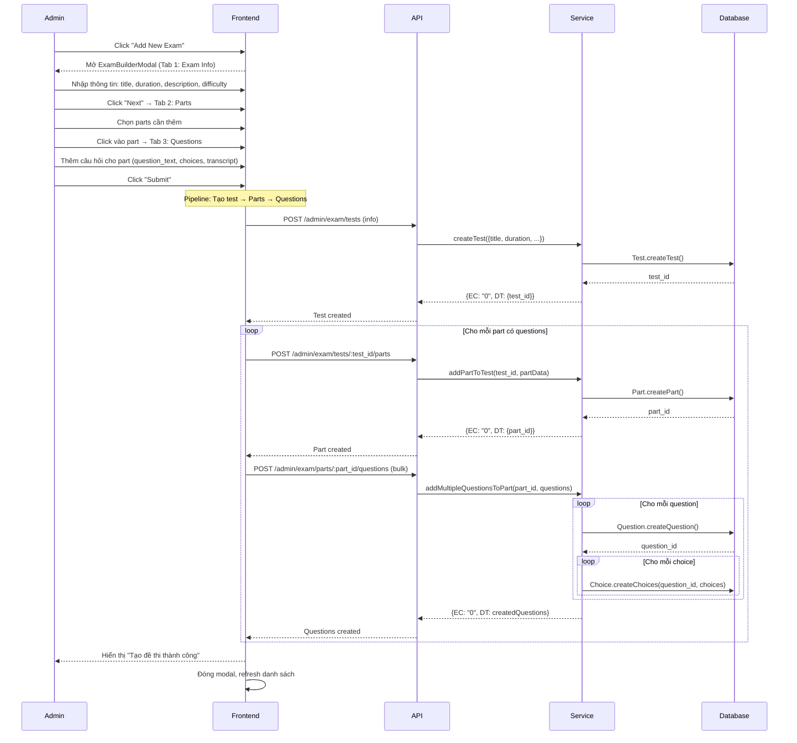

---

## SEQUENCE 3: XEM CHI TIẾT ĐỀ THI

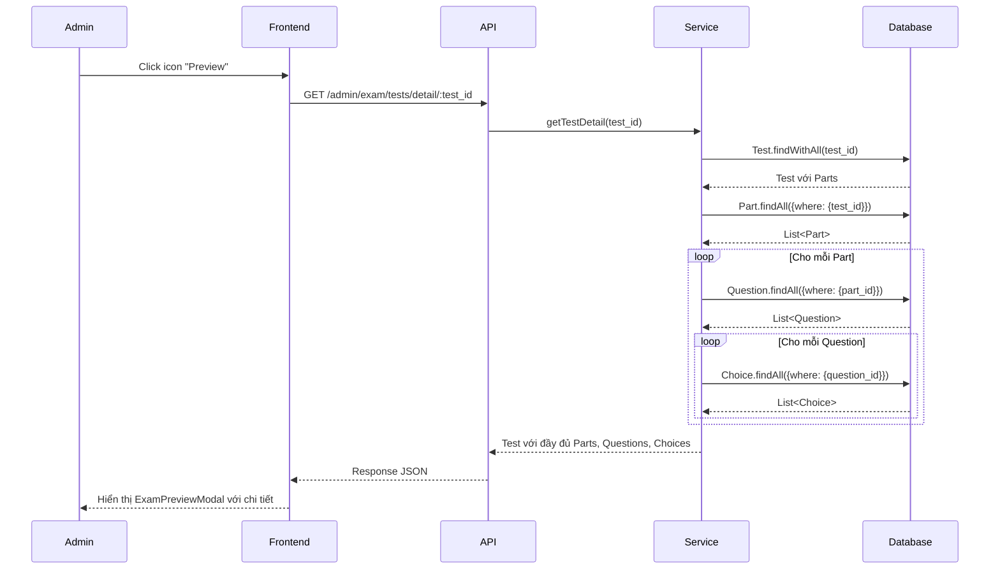

---

## SEQUENCE 4: CẬP NHẬT ĐỀ THI

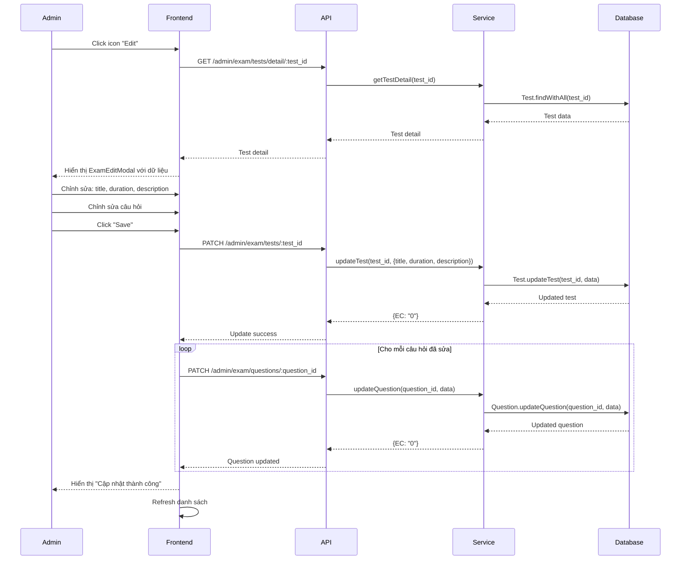

---

## SEQUENCE 5: XÓA ĐỀ THI

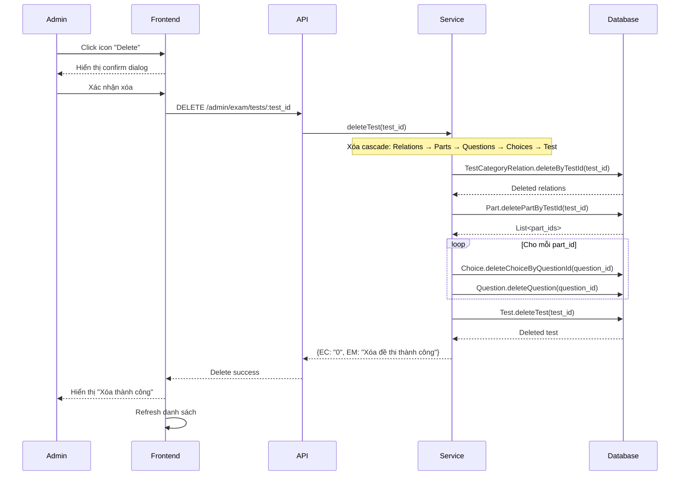

---

## SEQUENCE 6: THÊM PART VÀO ĐỀ THI

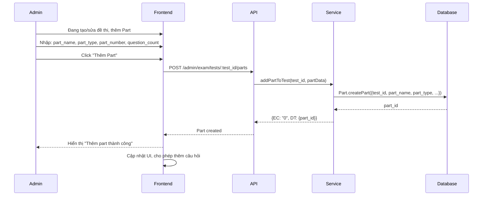

---

## SEQUENCE 7: THÊM CÂU HỎI VÀO PART (BULK)

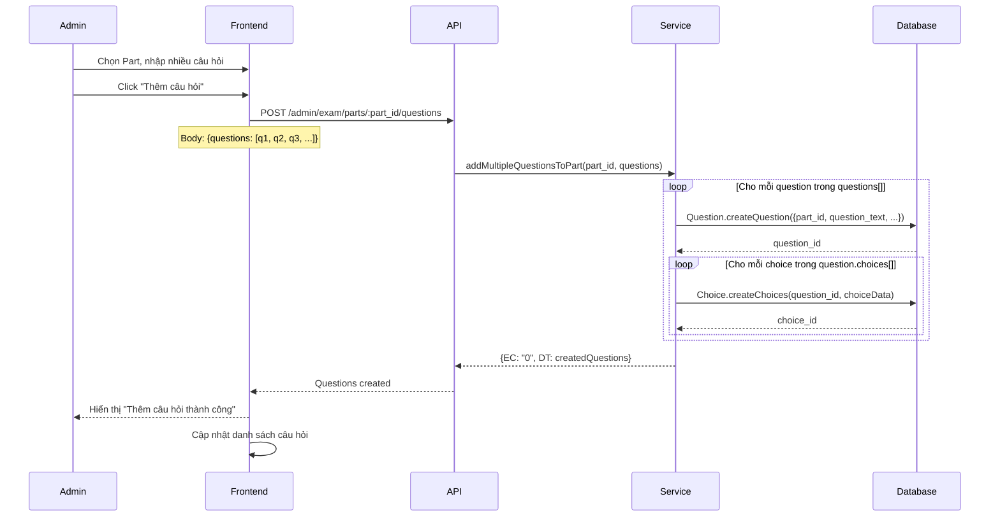

---

## SEQUENCE 8: CẬP NHẬT CÂU HỎI

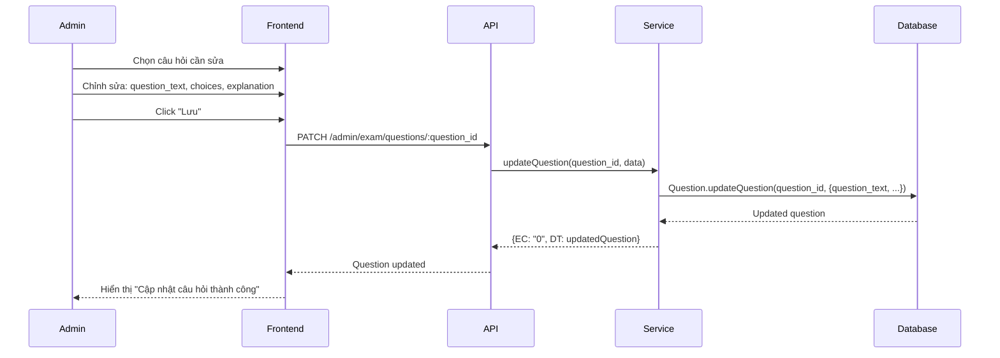

---

## SEQUENCE 9: XÓA CÂU HỎI

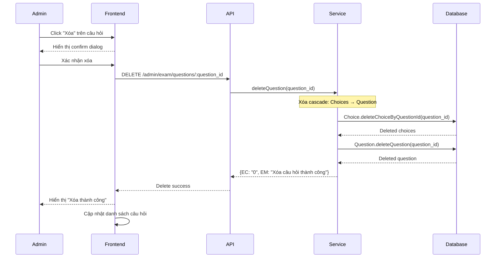

---

## SEQUENCE 10: XEM DANH SÁCH SESSIONS

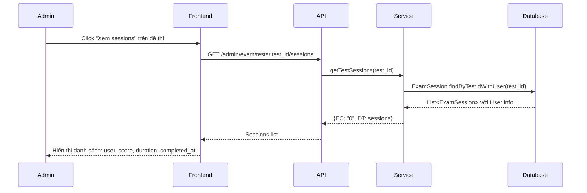

---

## SEQUENCE 11: XEM CHI TIẾT SESSION

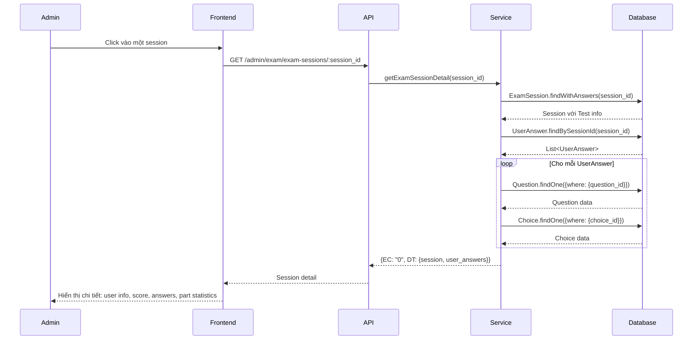

---

## SEQUENCE 12: XEM THỐNG KÊ ĐỀ THI

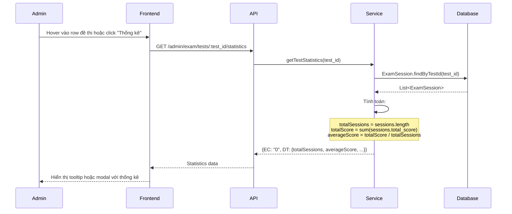

---

## TỔNG QUAN KIẾN TRÚC

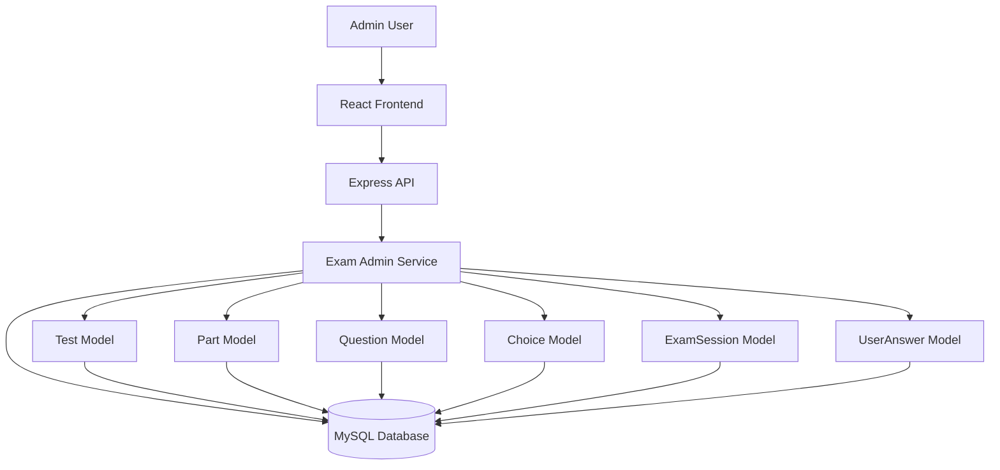

---

## LƯU Ý

1. **Pipeline tạo đề thi:** Tạo Test → Parts → Questions (tuần tự)
2. **Cascade delete:** Xóa Test sẽ xóa Parts → Questions → Choices
3. **Bulk operations:** Có thể thêm nhiều questions cùng lúc
4. **Statistics:** Tính toán real-time từ ExamSession data
5. **Error handling:** Mỗi bước có try-catch và trả về {EC, EM, DT}

